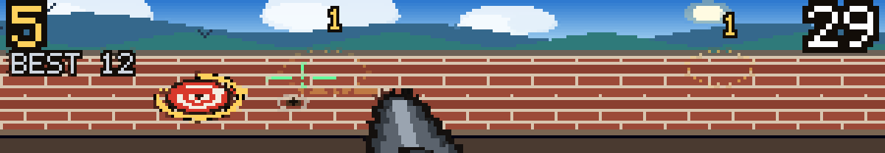
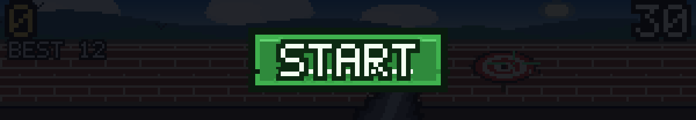
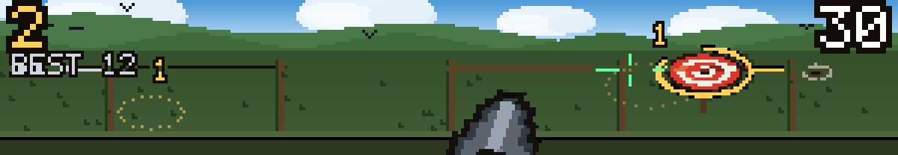
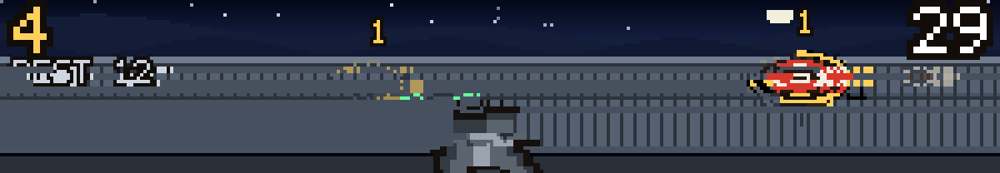
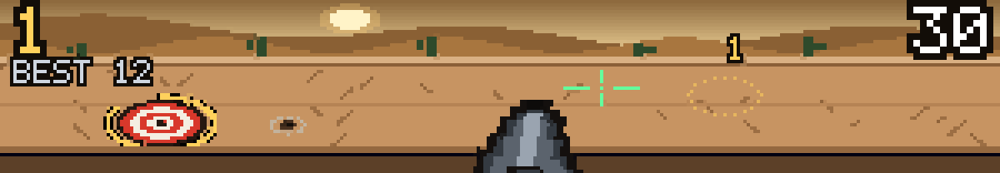

# cc-range

A first-person shooting gallery that lives above the Claude Code prompt. Pixel art drawn with
quadrant blocks, a pistol in your hand, a bullseye on a wall: aim with the pointer, fire, and
every hit moves the target somewhere else and adds a point.

It runs on **function hooks**, so it draws itself, takes your mouse and keyboard, and costs zero
tokens. You can play it while Claude works.



Thirty seconds from the first shot. Every hit makes the next target smaller, faster, and
shorter-lived — 2.7 seconds on its fuse at the start, three quarters of one by the end. Let the
fuse run out and the target leaves on its own, and takes your streak with it.



## Run it

```
CLAUDE_CODE_ENABLE_FUNCTION_HOOKS=1 claude --plugin-dir /path/to/cc-range
```

Then `/range`. Click the board once to give it the keyboard; `Esc` hands it back to the prompt.

| | |
|---|---|
| move the pointer | aim |
| click, `space`, `f` | fire |
| `wasd` or the arrows | aim without a mouse |
| the green plate | starts the round — it costs no shot |
| `r` | restart |
| `m` | mute, sound and music both |
| `q` | close the board |
| `/range stop` | close it from the prompt |
| `/range reset` | clear the record |

The clock only starts when you fire, so the board can sit open while you work. The record is on
screen under the score, and it and the mute setting live in `$.store`, so they outlast the
session. Misses leave holes in the wall.

## Eight backdrops, and one takes over every five seconds

Dawn, noon, a meadow, dusk, a starlit night, rain, snow, and the desert — each with its own sky,
ridges, and weather: sun, birds, clouds, stars, rainfall, snowfall, cacti. **The barrier changes
with it**, so it is planks, then brick, then nothing but posts in open grass, then hay bales,
corrugated iron, wet stone, a rope of bunting, and an adobe wall.







Everything you hear is synthesised by the two scripts in `tools/`: the shot, the ring of the
plate, the miss, and a sixteen-bar chiptune in A minor that plays under the whole thing. Nothing
here is sampled from anyone.

## Where it came from

[anthropics/claude-code#91870](https://github.com/anthropics/claude-code/issues/91870) proposes
function hooks — TypeScript that hooks into Claude Code the way Express middleware hooks into a
request, up to and including the React tree it renders. Buried in that thread,
[sezaakgun](https://github.com/sezaakgun) posted
[cc-arcade](https://github.com/sezaakgun/cc-arcade): Tetris and seven other games above the
prompt, playable while Claude works. That comment is why this exists.

Its write-up saved me the first day of the work, and the notes below are what I paid for on my
own, in the order the mistakes happened.

## Develop

```
bun tools/preview.ts 110 30 3       # one frame, in this terminal
bun tools/shot.ts out.png 110 30    # the same frame as a PNG, to judge the art
SCENE=3 bun tools/shot.ts out.png   # hold one backdrop still
MODE=ready bun tools/shot.ts out.png
node tools/make-sounds.mjs          # re-render the effects
node tools/make-music.mjs           # re-render the loop
bunx tsc --noEmit -p tsconfig.json  # run /plugin-types in Claude Code first,
                                    # which writes .claude/types
```

`tools/shot.ts` packs the canvas into quadrant cells and paints each one back out at 4×, so the
PNG is exactly what the terminal shows. Judging pixel art by squinting at ANSI in a scrollback is
not a thing you can do.

### What cost me time

- **Never name a local `h` in a surface module.** Every JSX tag compiles to a call of `h`, so a
  local shadows the factory and the tree throws `TypeError: h is not a function`.
- **`Client`'s `module` must be a string literal.** The engine reads the path off the source; a
  variable is refused at load.
- **A canvas pixel is half as wide as it is tall.** The buffer is twice the cell grid in both
  directions, but a terminal cell is about 1∶2, so anything round is an ellipse twice as wide as
  it is high — and the hit test has to agree with that, or you hit where you cannot see.
- **Play sounds from a timer, never inside the dispatch that asked for them.** A call of the
  dispatch's own is abandoned with it, and the game runs silent. *A promise chained off the
  dispatch is the same trap wearing a disguise*: `winding.then(() => $.audio.play(...))` lands
  after the dispatch has returned and is dropped just the same. That one cost me the music on the
  opening screen, and it took a user report to find.
- **`$.audio.play` refuses a fifth concurrent play.** A gallery asks for one every few frames, so
  `register.tsx` keeps its own count and a floor between starts. The shot is allowed past the
  floor: it is the sound the player is waiting for, and losing it is worse than overlapping it.
- **Aborting a loop only asks it to stop.** Start the next one before the old one has finished and
  the old one keeps playing with nothing holding its controller — a track that can never be
  stopped again.
- **A looping clip has to end where it begins.** Wrapping note tails round with a modulo leaves
  the last sample and the first at unrelated points of their waveforms, and every time round that
  step is a click — 10553 against a typical step of 56, in the first version.
  `make-music.mjs` renders a quarter-second past the end and folds it over the head instead.
- **An inverse map rotates a sprite by `-theta`.** Get the sign wrong and the gun leans away from
  the pointer instead of after it.
- **A gun that rotates about a pivot on screen looks broken.** Two attempts died here. With the
  barrel pointing up, the perpendicular is horizontal, so the grip swings out sideways and the
  whole thing reads as a tumbling object. What works is a pivot far below the band with only the
  top of the gun visible: then a rotation is a flat sweep, and nothing can swing anywhere wrong.
- **`{ ...obj, k: fn(obj) }` throws away what `fn` wrote to `obj`.** The spread is evaluated
  first. `place()` advances the RNG seed by mutating the game it is handed, so written that way
  the seed never moved and every target landed in the same four spots. Call it into a variable,
  spread afterwards.

## Layout

```
hooks/register.tsx      the command, the store, the sounds, the music, the AbovePrompt band
hooks/boards/range.tsx  the surface module: frame clock, keys, pointer
hooks/boards/scene.ts   one frame of the range, into a pixel canvas
hooks/boards/paint.ts   the canvas, a 5×7 face, and the quadrant packing
hooks/game/range.ts     the target, the aim, the clock, and what a shot does
tools/                  preview, PNG capture, and the two synthesisers
```

`paint.ts` is carried over from `cc-flappy`, an earlier plugin of mine, which is where the canvas
and the quadrant packing were worked out.

MIT.
