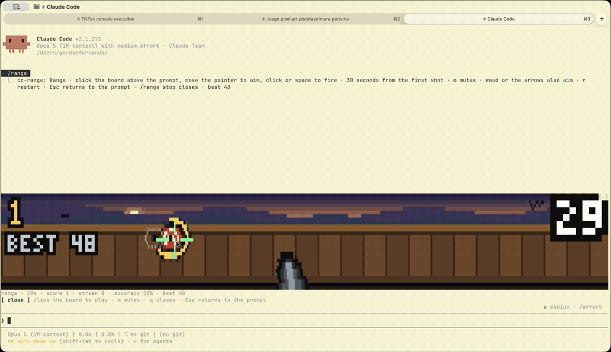
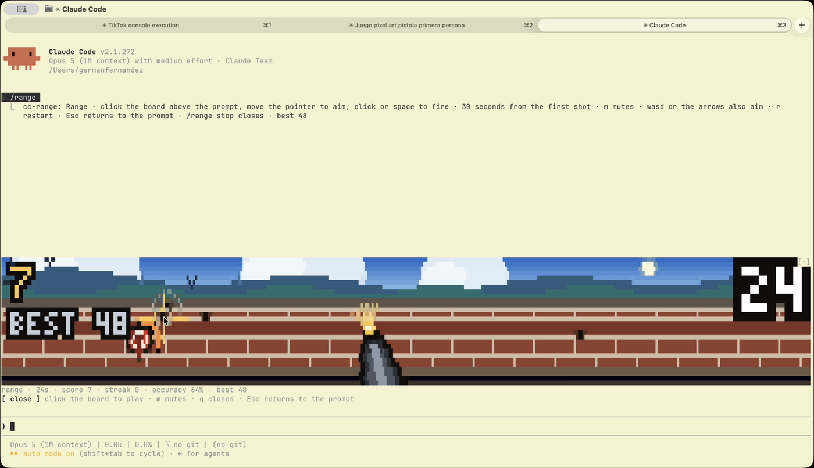
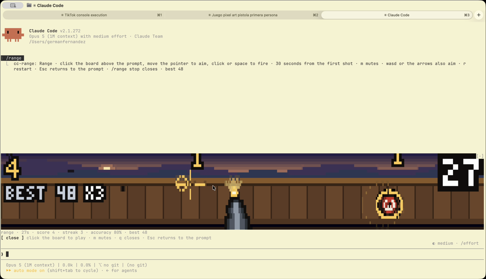

# cc-range

A first-person shooting gallery that lives above the Claude Code prompt. Pixel art drawn with
quadrant blocks, a pistol in your hand, a bullseye on a wall: aim with the pointer, fire, and
every hit moves the target somewhere else and adds a point.

It runs on **function hooks**, so it draws itself, takes your mouse and keyboard, and costs zero
tokens. You can play it while Claude works.



Thirty seconds from the first shot. Every hit makes the next target smaller, faster, and
shorter-lived — 2.7 seconds on its fuse at the start, three quarters of one by the end. Let the
fuse run out and the target leaves on its own, and takes your streak with it.

Needs function hooks (early access, `CLAUDE_CODE_ENABLE_FUNCTION_HOOKS=1`) and an interactive
terminal.

## Install

```
/plugin marketplace add germanfndez/cc-range
/plugin install cc-range@cc-range
```

Then `/range`. Click the board once to give it the keyboard; `Esc` hands it back to the prompt.

Working on it instead? `CLAUDE_CODE_ENABLE_FUNCTION_HOOKS=1 claude --plugin-dir /path/to/cc-range`.

| | |
|---|---|
| move the pointer | aim |
| click, `space`, `f` | fire |
| `wasd` or the arrows | aim without a mouse |
| the green plate | starts the round — it costs no shot |
| `r` | restart |
| `m` | mute, sound and music both |
| `q` | close the board |
| `/range stop` | close it from the prompt |
| `/range reset` | clear the record |

The clock only starts when you fire, so the board can sit open while you work. The record is on
screen under the score, and it and the mute setting live in `$.store`, so they outlast the
session. Misses leave holes in the wall.

## Eight backdrops, and one takes over every five seconds

Dawn, noon, a meadow, dusk, a starlit night, rain, snow, and the desert — each with its own sky,
ridges, and weather: sun, birds, clouds, stars, rainfall, snowfall, cacti. **The barrier changes
with it**, so it is planks, then brick, then nothing but posts in open grass, then hay bales,
corrugated iron, wet stone, a rope of bunting, and an adobe wall.






Everything you hear is synthesised by the two scripts in `tools/`: the shot, the ring of the
plate, the miss, and a sixteen-bar chiptune in A minor that plays under the whole thing. Nothing
here is sampled from anyone.

## Where it came from

[anthropics/claude-code#91870](https://github.com/anthropics/claude-code/issues/91870) proposes
function hooks — TypeScript that hooks into Claude Code the way Express middleware hooks into a
request, up to and including the React tree it renders. Buried in that thread,
[sezaakgun](https://github.com/sezaakgun) posted
[cc-arcade](https://github.com/sezaakgun/cc-arcade): Tetris and seven other games above the
prompt, playable while Claude works. That comment is why this exists.

Its write-up saved me the first day of the work.

## Develop

```
bun tools/preview.ts 110 30 3       # one frame, in this terminal
bun tools/shot.ts out.png 110 30    # the same frame as a PNG, to judge the art
SCENE=3 bun tools/shot.ts out.png   # hold one backdrop still
MODE=ready bun tools/shot.ts out.png
node tools/make-sounds.mjs          # re-render the effects
node tools/make-music.mjs           # re-render the loop
bunx tsc --noEmit -p tsconfig.json  # run /plugin-types in Claude Code first,
                                    # which writes .claude/types
```

`tools/shot.ts` packs the canvas into quadrant cells and paints each one back out at 4×, so the
PNG is exactly what the terminal shows. Judging pixel art by squinting at ANSI in a scrollback is
not a thing you can do.

## Layout

```
hooks/register.tsx      the command, the store, the sounds, the music, the AbovePrompt band
hooks/boards/range.tsx  the surface module: frame clock, keys, pointer
hooks/boards/scene.ts   one frame of the range, into a pixel canvas
hooks/boards/paint.ts   the canvas, a 5×7 face, and the quadrant packing
hooks/game/range.ts     the target, the aim, the clock, and what a shot does
tools/                  preview, PNG capture, and the two synthesisers
```

`paint.ts` is carried over from `cc-flappy`, an earlier plugin of mine, which is where the canvas
and the quadrant packing were worked out.

MIT.
